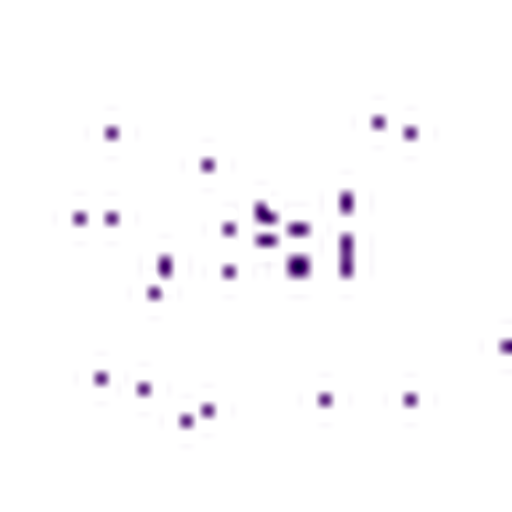

# نرخ چند؟ | Nerkh Chand

<p align="center">
  
</p>

<p align="center">
  افزونه حرفه‌ای وردپرس برای واکشی، ذخیره و نمایش نرخ ارز و طلا با پنل RTL، شورت‌کدهای منعطف و ویجت‌های Elementor
</p>

<p align="center">
  <a href="https://www.gnu.org/licenses/gpl-2.0.html"></a>
  
  
  
</p>

## معرفی

`نرخ چند؟` یک افزونه WordPress است که داده نرخ را از منابع مختلف می‌گیرد، داخل دیتابیس ذخیره می‌کند و در قالب‌های مختلف (جدول، کارت، تیکر) نمایش می‌دهد.

این افزونه برای وب‌سایت‌های ایرانی طراحی شده است و برای عملکرد پایدارتر، پیشنهاد می‌شود روی سرور داخل ایران اجرا شود.

منابع پیش‌فرض فعلی:

- ICE: نرخ حواله
- ICE: تاریخچه دلار
- milli.gold: قیمت 18 عیار
- CBI: حواله

## امکانات کلیدی

- پنل مدیریت فارسی (RTL) با منوی مستقل
- واکشی دستی و خودکار با بازه جداگانه برای هر منبع
- ذخیره یکتا بر اساس `source + date` (به‌روزرسانی در همان روز)
- خطایابی فنی و گزارش آخرین خطا
- شورت‌کدهای متنوع (از خروجی کامل تا بخش‌بندی ریز)
- ویجت‌های Elementor برای پیاده‌سازی سریع
- قفل منابع سیستمی (غیرقابل حذف/ویرایش حساس)

## نصب سریع

1. پروژه را داخل `wp-content/plugins/exchange-rate` قرار دهید.
2. افزونه را فعال کنید.
3. از منوی `نرخ چند؟` منابع را بررسی/مدیریت کنید.
4. واکشی دستی بزنید و شورت‌کد یا ویجت را در سایت قرار دهید.

## شورت‌کد اصلی

```text
[exchange_rate source="ice_havaleh" view="table"]
```

پارامترهای مهم:

- `source`
- `symbols`
- `date`
- `limit`
- `title`
- `subtitle`
- `view` => `table | cards | ticker`
- `section` => `full | title | description | source_meta | fetch_date | table_only`

## Elementor

دسته اختصاصی: `نرخ چند؟`

ویجت‌های موجود:

- نرخ چند؟ - جدول
- نرخ چند؟ - کارت‌ها
- نرخ چند؟ - تیکر
- نرخ چند؟ - بخش خروجی

## مستندات توسعه

- راهنمای کامل توسعه: [`DEVELOPER_GUIDE.md`](DEVELOPER_GUIDE.md)
- راهنمای فرمت WordPress.org: [`readme.txt`](readme.txt)
- نمونه Relay (Cloudflare Worker): [`docs/cloudflare-worker.js`](docs/cloudflare-worker.js)

## امنیت

- محافظت در برابر SSRF برای URLهای نامعتبر/خصوصی
- nonce + capability check در اکشن‌های مدیریتی
- ماسک و حفاظت از داده‌های حساس منابع سیستمی
- قفل سمت سرور برای جلوگیری از دور زدن UI

## انتشار عمومی

این پروژه برای استفاده عمومی و توسعه جمعی منتشر می‌شود.  
Pull Request و Issue خوشحال‌کننده است.

## دارایی‌های برند و وردپرس

فایل‌های لوگو/آیکن/بنر در مسیر زیر قرار گرفته‌اند:

- `branding/wporg/atomsoft-logo-white-bg.png`
- `branding/wporg/icon-128x128.png`
- `branding/wporg/icon-256x256.png`
- `branding/wporg/banner-772x250.png`
- `branding/wporg/banner-1544x500.png`

## توسعه‌دهنده

- علی فیروزی
- اتم سافت - OpenAI
- وب‌سایت: https://atomsoft.ir/

---

### نکته لوگو

برای نمایش لوگوی واقعی در GitHub، فایل لوگو را در این مسیر قرار دهید:

`docs/images/atomsoft-logo.png`
